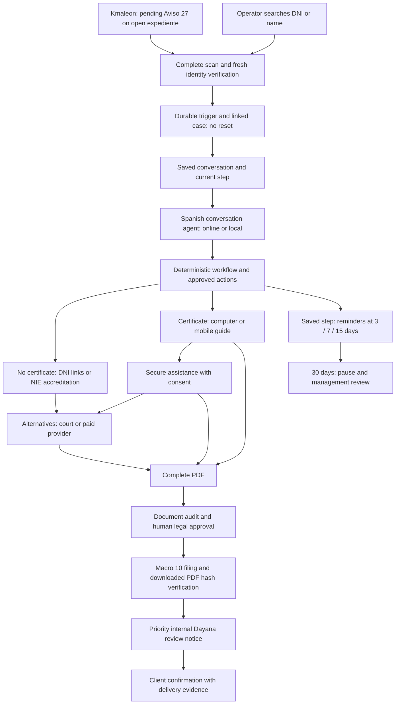

# Aviso 27 — implementation and operating notes

Updated 16 September 2026. Source: `/Users/litigiosmacmini/Downloads/apud_acta_master_prompt.md`, approved by the user. Node.js/Fastify, TypeScript, PostgreSQL/Prisma and Redis/BullMQ remain the runtime.

## Implemented flow

The background reader verifies every provider page before exposing a trigger. Only the exact live Macro 27 catalogue text, pending flag and an open project qualify. Client identity and contact are rechecked before linking. Source annotation IDs are unique. Re-observation does not reset a case or enqueue another initial contact. Ambiguous identity or multiple cases sharing the same client/phone stay pending for staff.

Live catalogue verification identified Macro 10 as **DOCUMENTO 1 APUD ACTA**, APUD class **453**. Kmaleon does not expose a directly readable `macro_codigo` result: final proof checks the resulting catalogue text, unique APOD marker, document class, completed macro processing and downloaded PDF SHA-256. Provisional documents do not execute Macro 10. Dayana's verified account is **MORERA DE LA NUEZ, DAYANA**, recipient **13466**, active USUARIO, corroborated by existing annotation recipients.

## Conversation, continuity and reminders

`BotApodMessage` stores minimized inbound and accepted outbound context. Only the newest 12 messages, at most 2,000 characters each and 12,000 total, enter the model. Prior messages are untrusted context and cannot grant consent or authorize an action. Authorized staff can import dated previous messages from the same verified client through the case panel.

`stepReached`, `stepEnteredAt`, `previousState`, `reminderCycle`, `reminderAnchorAt`, `reminderCount`, `lastReminderDay`, `nextReminderAt`, `automationPaused` and `optOutAt` persist independently of server uptime. Recovery preserves the saved step and evidence. A changed semantic step also updates tracking when the coarse state remains unchanged, such as asking about the device after certificate confirmation.

The outbox proposes reminders at days 3, 7 and 15 of the current silence cycle. A client reply invalidates old reminders. After downtime only the latest due reminder is proposed, avoiding a backlog of sends. Each send rechecks the current step, silence cycle, incoming messages, pause and opt-out. At day 30 a conditional database update pauses automation and creates one management task; a concurrent reply prevents creation against an obsolete cycle. External API acceptance is distinguished from delivered/read callbacks.

The pending secure-certificate step has its own reminder context. Receipt through the secure assistance session ends client reminders for that step and creates an assisted-processing task. A certificate and its password are **not** an Apud Acta PDF and never complete filing.

Outside the WhatsApp service window, each reminder needs a reviewed Meta template keyed by `FOLLOWUP_DAY3:<stepReached>`, `FOLLOWUP_DAY7:<stepReached>` or `FOLLOWUP_DAY15:<stepReached>`. Returning initial contact uses `ASK_HAS_CERT:RETURNING`. See `config/whatsapp-templates.example.json`; example names are placeholders and the example is deliberately not approved.

## Human boundaries

The panel's **Revisión humana** page shows legal document review, assisted work, client support and 30-day management tasks. Each case shows its saved step, reminder status, minimized messages and pause/resume controls. Review resolution records the operator and evidence. Document and assisted-processing tasks are resolved through their specific evidence-bearing workflows.

Client messages identify the bot as the virtual assistant of LITIGIOS. Dayana is a human reviewer. The system does not claim that a lawsuit has been filed merely because a PDF was received. No unspecified contractual charge is calculated or executed: management must establish the applicable terms and decision. Certificate passwords are excluded from ordinary WhatsApp context; existing consent-bound assistance remains separate. Email stays outside this workflow.

## Configuration and operation

Secrets remain in `.env` (ignored by git). `DAYANA_USER_ID=13466` is configured. Local AI is prepared with `AI_MODE=local`, `LOCAL_AI_BASE_URL`, `LOCAL_AI_MODEL` and optional `LOCAL_AI_API_KEY`. The user will choose `LOCAL_AI_MODEL` later. An incomplete or unavailable local provider never silently routes to the online provider. The current running configuration uses the already configured online Luna model. No fine-tuning was performed by this implementation.

`KMALEON_POLLER_ENABLED` enables autonomous live intake, and `KMALEON_POLL_INTERVAL_MS` controls its interval. `REMINDERS_ENABLED` controls scheduling. The WCE launcher generates `.env.wce`, keeps the live Kmaleon poller and CRM writes disabled, and confines delivery to the local bridge. The running dashboard labels this explicitly as the WCE simulator.

- Start simulator and service: `npm run wce:start`
- Dashboard: http://127.0.0.1:4720
- Simulator: http://127.0.0.1:8080
- Read-only runtime verification: `ENV_FILE=.env.wce npm run verify:new-spec`
- Read-only browser verification: `ENV_FILE=.env.wce npm run verify:ui`
- Real provider check using an existing anonymized historical turn: `ENV_FILE=.env.wce npm run verify:live-ai`

## Verification and remaining limits

The database was backed up before migration. Migration `20260916150000_aviso27_automation` was applied to the existing local PostgreSQL database; all four case states, versions, consent flags, document links and approvals were preserved. TypeScript compilation and real-server browser checks passed, including the new pages, authentication, case detail and mobile layout. No browser JavaScript errors were observed.

Read-only live Kmaleon validation scanned 442 annotation rows across six pages and found 13 exact pending/open triggers. Fresh client resolution succeeded. Two downloads of an existing 198,559-byte Macro 10 PDF had matching hashes. No CRM writes were made. A real online-model request using an existing anonymized historical conversation returned a Spanish response accepted by the production reply validator. The local-model readiness check correctly remains incomplete until a model is chosen.

These checks do not establish 95% production automation, live WhatsApp delivery, a newly written Macro 10/Dayana notice, legal sufficiency of client documents, live Sede submission or partner payment execution. Required business inputs and production configuration are listed in `docs/PREGUNTAS_PENDIENTES.md`. Existing mock harnesses were not used as evidence; `npm test` now selects the real-input verifier, which requires its authorized document manifest.
