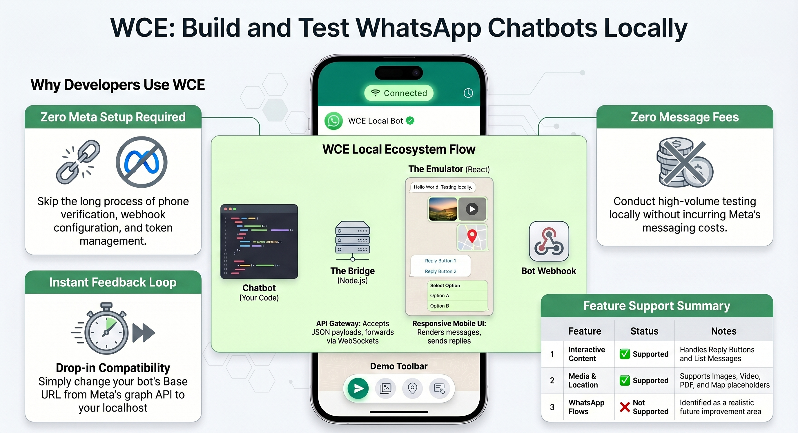

# 📱 WCE: WhatsApp Cloud Emulator
**Develop, Test, and Debug WhatsApp Chatbots locally. Zero configs, Zero public server, Zero phone testing.**

WCE is an open-source development environment that mimics the WhatsApp Cloud API. It acts as a "Local Meta Server," allowing you to point your chatbot's API requests to your localhost and see the results instantly in a React-based mobile UI.

> It's a full drop-in for WhatsApp server - allowing you to have zero changes when moving between WCE emulator and WhatsApp real testing or production on mobile



## ⚡ Why WCE?

Building chatbots is usually a pain:

  * ❌ **Slow feedback loops:** Send code -\> Deploy -\> Test on physical device.
  * ❌ **Cost:** Message fees during high-volume testing.
  * ❌ **Tedious setup:** Long journeys of whatsapp setup -> webhook verify -> code -> deploy -> test on phone...

**WCE solves this:**

  * ✅ **Instant Feedback:** See messages render in milliseconds.
  * ✅ **Full Media Support:** Text, Images, Videos, Documents, Locations.
  * ✅ **Interactive Support:** Buttons, Lists, and Reply workflows.
  * ✅ **Meta Events:** Simulates "Read Receipts," "Typing Indicators," and "Reactions."
  * ✅ **Persistence:** Chat history survives refreshes (stored locally).


## 🏗️ Architecture

```
┌─────────────┐      Full WA Payload     ┌──────────────┐      Simple JSON      ┌─────────────┐
│             │  ──────────────────────> │              │  ──────────────────>  │             │
│  Your Bot   │                          │    Bridge    │                       │  React UI   │
│             │  <────────────────────── │    Server    │  <──────────────────  │  Emulator   │
└─────────────┘      Full WA Webhook     └──────────────┘      Simple Reply     └─────────────┘
                                           (Translator)
```


WCE consists of two lightweight components:

1.  **The Bridge (Node.js):** Acts as the API Gateway. It accepts standard WhatsApp JSON payloads via HTTP and forwards them to the UI via WebSockets.
2.  **The Emulator (React):** A responsive mobile UI that renders the messages and allows you to "reply" as a user, sending webhooks back to your bot.


## 🚀 The WCE Chatbot Ecosystem

WCE is an extension of my work building robust, template-driven, professional tools for the WhatsApp Cloud API. This project is designed to be the perfect testing environment for any chatbot built using my dedicated frameworks:

| Framework | Language/Platform | Description |
| :--- | :--- | :--- |
| [**pywce**](https://github.com/DonnC/pywce) | Python | A **general-purpose Python framework** designed to abstract the complexities of the Cloud API, making it easy to build powerful bots with simple, elegant code. |
| [**frappe-pywce**](https://github.com/DonnC/frappe_pywce) | Frappe/ERPNext | Built on pywce, this framework enables **seamless, deep integration** of WhatsApp bots with the Frappe/ERPNext ecosystem for enterprise-grade automation with a visual node based ui for conversational flows. |
| [**jawce**](https://github.com/DonnC/jawce) | Java Springboot | A modern, high-performance framework for creating **Enterprise grade** chatbots, focusing on speed and modularity. |


## 🚀 Getting Started


### Prerequisites

  * Node.js (v16+)
  * npm or yarn

### Installation

1.  **Clone the repository**

    ```bash
    git clone https://github.com/DonnC/wce-emulator.git
    cd wce-emulator
    ```

2.  **Install Dependencies:**
    We use a unified script to install dependencies for both the bridge and the emulator.

    ```bash
    npm install
    npm run postinstall
    ```

3.  **Setup ChatBot Webhook**
    For the bridge to listen and send messages to your ChatBot. Set your webhook url to your `env` var with key: `BOT_WEBHOOK_URL`

    Or edit the line in [bridge/index.js](/bridge/index.js)

    ```js
    // TODO: Change this to your bot's webhook URL
    const BOT_WEBHOOK_URL = process.env.BOT_WEBHOOK_URL || "<YOUR-CHATBOT-WEBHOOK-URL>";
    ```

4.  **Run the Suite:**
    Start both the Bridge and the Emulator with a single command:

    ```bash
    npm run dev
    ```

      * **Emulator UI:** `http://localhost:8080`
      * **Bridge API:** `http://localhost:3001/send-to-emulator` (or the port logged in terminal)


## 🔌 Connecting Your Bot

To test your bot, you simply need to change the meta **Base URL** of your chatbot API requests.

**Instead of sending to:**
`https://graph.facebook.com/<VERSION>/<PHONE_NUMBER_ID>/messages`

**Send to:**
`http://localhost:3001/send-to-emulator`

### Example (Node.js / Axios)
In your WhatsApp chatbot logic

```javascript
const axios = require('axios');

const EMULATOR_URL = 'http://localhost:3001/send-to-emulator';
const META_WHATSAPP_URL =  'https://graph.facebook.com/<VERSION>/<PHONE_ID>/messages'; 


// Toggle this based on your environment
const IS_DEV = process.env.NODE_ENV === 'development';
const BASE_URL = IS_DEV ?  EMULATOR_URL : META_WHATSAPP_URL;

await axios.post(BASE_URL, {
  messaging_product: "whatsapp",
  to: "123456789",
  type: "text",
  text: { body: "Hello from WCE localhost!" }
});
```

That's it\! Your bot thinks it's talking to Meta, but WCE intercepts the message and renders it.

-----

## 🛠️ Supported Features

| Feature | Status | Notes |
| :--- | :--- | :--- |
| **Text** | ✅ Supported | All text formatting supported |
| **Media** | ✅ Supported | (Dummy) Images, Video, Documents (PDF) |
| **Location** | ✅ Supported | Renders map placeholders |
| **Interactive** | ✅ Supported | Reply Buttons, List Messages |
| **Reactions** | ✅ Supported | Shows toast notification |
| **Status** | ✅ Supported | 'Sent', 'Delivered', 'Read' |

-----

## 🤝 Contributing

We believe tools like this should be community-driven. Whether it's fixing a bug, adding support for a new message type (like Catalogues or Flows), or improving the UI, your help is welcome\!

1.  Fork the Project
2.  Create your Feature Branch (`git checkout -b feature/AmazingFeature`)
3.  Commit your Changes (`git commit -m 'Add some AmazingFeature'`)
4.  Push to the Branch (`git push origin feature/AmazingFeature`)
5.  Open a Pull Request

-----

## ☕ Support the Project

Open source is fueled by passion and caffeine. If WCE saved you hours of debugging time, consider supporting the maintenance and development of new features.

  * Star the project 💫
  * Fork and contribute 🍴
  * Share the project
  * [**GitHub Sponsors**](https://www.google.com/search?q=https://github.com/sponsors/DonnC)
  * Or use the Sponsor button at the top of this page for more options

*Your support ensures this tool and other projects i do stays up-to-date with the ever-changing WhatsApp API.*

-----

## 👨‍💻 Need a Custom Chatbot Solution?

Hi, I'm **DonnC**.

I am the architect behind WCE. I specialize in building industrial-grade, data-driven chatbot solutions that integrate deeply with business systems.

While WCE is a great tool for developers, sometimes you need a complete, turnkey solution.

**I can help you with:**

  * **Enterprise Chatbots:** Bots that integrate with ERPs (SAP, ERPNext, Odoo) to fetch live order status, inventory, and customer data.
  * **Complex Flows:** Designing state-machines for complex customer support or sales journeys.
  * **Self-Hosted Solutions:** Breaking free from expensive SaaS monthly fees by owning your own stack.

If you are looking to build a serious conversational interface for your business, let's talk.

[**📩 Contact Me for Consulting**](mailto:donychinhuru@gmail.com) | [**🌐 My Portfolio**](https://github.com/DonnC) | [**👔 LinkedIn**](https://www.linkedin.com/in/donchinhuru/)

-----

**License**
Distributed under the MIT License. See `LICENSE` for more information.